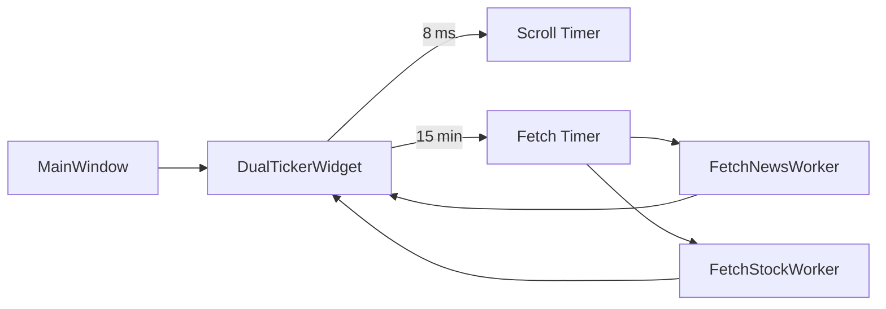

# 東海道新幹線車内ニュース風のティッカー

PyQt5 製のデスクトップウィジェットで、**Yahoo! ファイナンスの最新ニュース見出し**と**米国株の時価総額ランキング**を 2 行のティッカーとして常時スクロール表示します。  
1920 × 420 のデジタルサイネージを想定していますが、リサイズやフルスクリーンにも対応します。

Raspberry Pi Pico 2 Wと横長ディスプレイで省電力運用しています。

https://akizukidenshi.com/catalog/g/g130330/

https://online.nojima.co.jp/commodity/1/0479960021309/

---

## 主な機能

| 区分 | 概要 |
|------|------|
| **リアルタイム取得** | Yahoo! ファイナンスから 15 分ごとに最新データを取得し、`requests.Session` で接続を再利用。 |
| **デュアルティッカー** | *上段*: ニュース見出し / *下段*: ティッカー・終値・前日比 % |
| **滑らかなスクロール** | 8 ms ごとにオフセット更新、アンチエイリアス描画。行ごとに独立した速度設定。 |
| **ショートカット** | `F12` → ダーク / ライトテーマ切替<br>`F11` → フルスクリーン / ウィンドウ切替 |
| **堅牢設計** | QThread でネットワーク処理を分離し UI フリーズを防止。例外はすべてログ出力。 |
| **クリーン終了** | アプリ終了時に HTTP セッションを明示的にクローズ。 |

---

## インストール

```bash
# リポジトリを取得
git clone https://github.com/otomamaYuY/newsticker.git
cd newsticker

# （任意）仮想環境を作成
python -m venv .venv
source .venv/bin/activate        # Windows: .venv\Scripts\activate

# 依存パッケージをインストール
pip install -r requirements.txt
```

---

## 使い方

```bash
python news.py
```

| キー | 動作 |
|------|------|
| `F11` | フルスクリーン / ウィンドウ切替 |
| `F12` | ダーク / ライトテーマ切替 |

---

## 設定パラメータ

| 項目 | デフォルト | 変更箇所 | 説明 |
|------|-----------|----------|------|
| ウィンドウサイズ | `1920×420` | `MainWindow.__init__` | 固定サイズを解除すれば自由にリサイズ可能 |
| フォント | `"Noto Sans CJK JP", 60px` | `DualTickerWidget.__init__` | CJK 向け。英語フォント等に変更可 |
| スクロール速度 | ニュース: 15 px/更新<br>株価: 7.5 px/更新 | 同上 | 数値を下げるとゆっくりスクロール |
| データ更新間隔 | 15 分 | `fetch_timer.start(900000)` | ミリ秒単位 |

---

## アーキテクチャ概要



---

## 制約事項 & 法的注意

* 当ツールは公開 HTML をスクレイピングします。データの正確性や可用性は Yahoo! ファイナンス側に依存します。  
* ご利用の際は対象サイトの利用規約を遵守してください。  
* 作者および本リポジトリは Yahoo! JAPAN とは一切関係ありません。  
